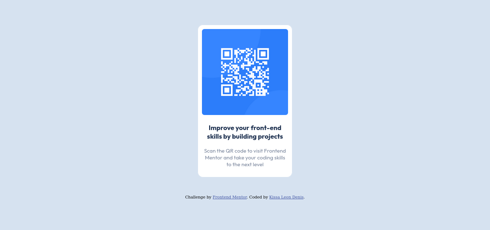

# Frontend Mentor - QR code component solution

This is a solution to the [QR code component challenge on Frontend Mentor](https://www.frontendmentor.io/challenges/qr-code-component-iux_sIO_H). Frontend Mentor challenges help you improve your coding skills by building realistic projects. 

## Table of contents

- [Overview](#overview)
  - [Screenshot](#screenshot)
  - [Links](#links)
  - [Built with](#built-with)
  - [What I learned](#what-i-learned)
  - [Continued development](#continued-development)
  - [Useful resources](#useful-resources)
- [Author](#author)
- [Acknowledgments](#acknowledgments)

## Overview

### Screenshot

](./screenshot.jpg)

### Links

- Solution URL: [https://your-solution-url.com](https://happy-lama.github.io/qr-code-challenge-solution/)

### Built with

- Semantic HTML5 markup
- Flexbox

### What I learned

I learned how to use CSS flexbox to easily achieve layouts with relative ease and just a few lines of code. 

### Continued development

Using CSS flexbox and CSS grid and responsive web layout 

### Useful resources

- [Learn CSS Grid the easy way](https://www.youtube.com/watch?v=rg7Fvvl3taU) - This helped me to learn more about web layout in CSS and provided me an easy way to make complex but structured layouts easily. I really liked this pattern and will use it going forward.
- [Learn flexbox the easy way](hhttps://www.youtube.com/watch?v=u044iM9xsWU) - This is an amazing video which helped me finally understand how to use CSS flexbox. I'd recommend it to anyone still learning this concept.

## Author

- Frontend Mentor - [@yourusername](https://www.frontendmentor.io/profile/yourusername)

